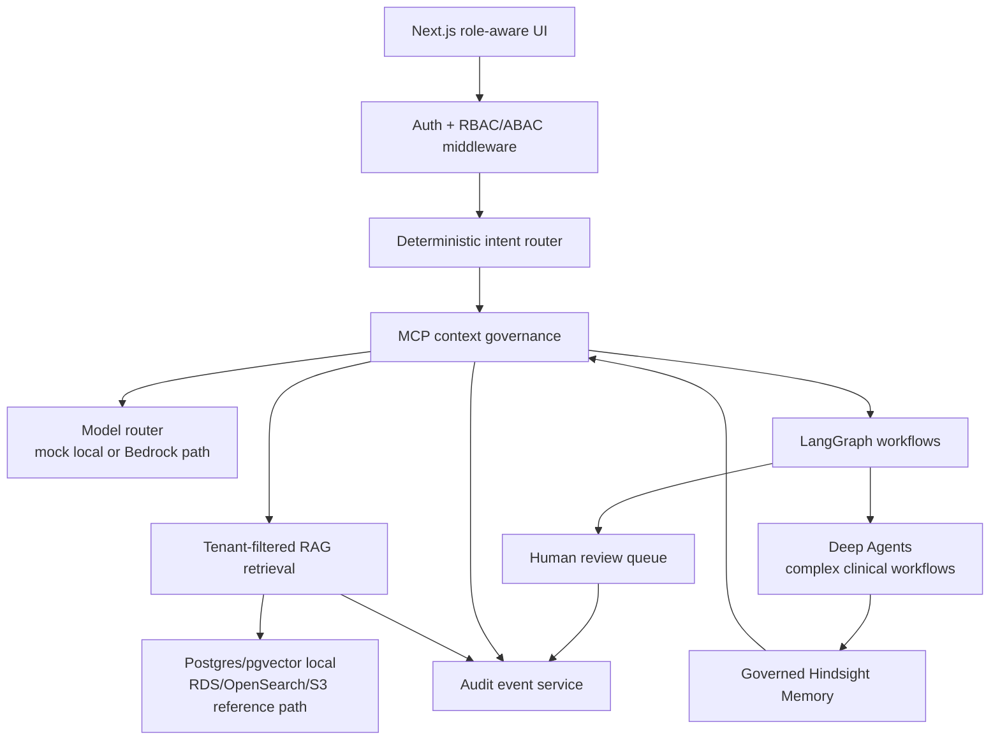
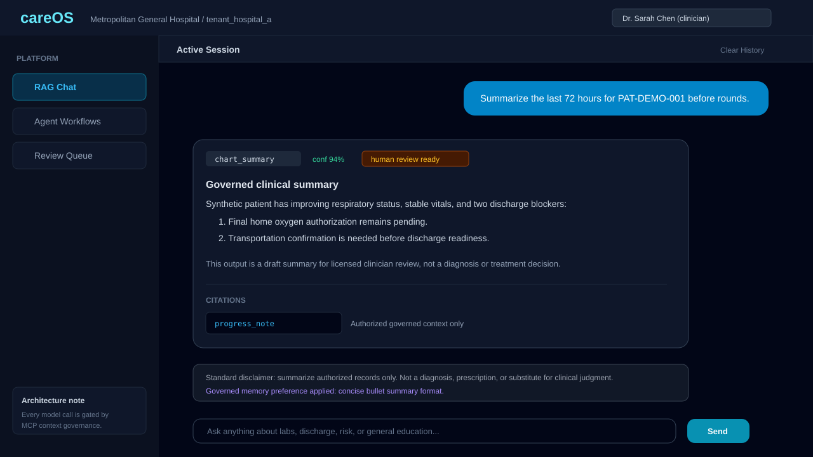
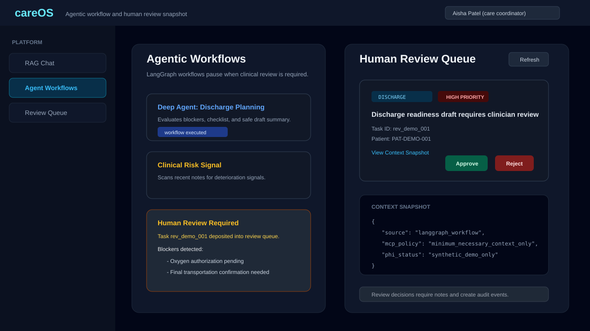

# careOS

[](https://github.com/Anudeepsrib/CareOS/actions/workflows/ci.yml)


careOS is a recruiter-ready flagship case study for a governed hospital AI platform. It demonstrates how to route clinical AI requests through deterministic safety controls, tenant-aware retrieval, human review, audit logging, and role-scoped UI workflows before any model output reaches a user.

This repository is a **HIPAA-aware reference implementation**, not a product certified as compliant with HIPAA. It maps to relevant Privacy and Security Rule safeguards, but production use with real PHI would still require formal risk analysis, BAAs, clinical validation, live AWS evidence, penetration testing, and organizational policy sign-off.

> **Clinical Safety Rule**: careOS never diagnoses, prescribes, or makes final clinical decisions. It summarizes authorized records, flags risk signals, drafts workflow artifacts for review, and escalates safety-sensitive outputs to licensed human review.

## Executive Summary

Health systems want the productivity of AI without letting PHI, unsafe clinical advice, or unaudited agent behavior slip through the cracks. careOS solves that as a reference architecture:

- **Deterministic router first**: safety-critical requests are classified before any agent is invoked.
- **MCP governance as the model gate**: tenant, patient, consent, role, and prompt-injection checks decide what context may reach an LLM.
- **LangGraph and Deep Agents where they add value**: chart summary, risk signal, discharge planning, prior authorization, patient-message triage, hospital operations, and compliance review are modeled as governed workflows.
- **Human review as a state machine**: medium/high-risk outputs create review tasks instead of relying on UI warnings.
- **Auditability by design**: route decisions, review events, and model-governance metadata are recorded through an audit service.
- **Production-oriented AWS path**: Terraform modules model private networking, KMS, Cognito, RDS, OpenSearch, Redis, S3, ECS, WAF, CloudTrail, CloudWatch, and service-scoped IAM.

For the long-form case study, see [docs/CASE_STUDY.md](docs/CASE_STUDY.md).

## Implemented vs Planned Matrix

| Capability | Status | Evidence |
| --- | --- | --- |
| Deterministic intent routing with safety overrides | Implemented | `services/platform-api/app/services/intent_router/service.py`, `tests/unit/test_intent_router/test_router.py` |
| Mandatory MCP context governance before model calls | Implemented | `services/platform-api/app/services/mcp/service.py`, `tests/unit/test_mcp/test_mcp_governance.py` |
| Tenant-aware RBAC/ABAC context | Implemented | `services/platform-api/app/core/context.py`, `services/platform-api/app/core/middleware.py` |
| Human review queue and role-filtered resolution | Implemented with DB path and local fallback | `services/platform-api/app/api/v1/reviews.py`, `tests/unit/test_reviews/test_review_authorization.py` |
| Audit event capture and query endpoints | Implemented with DB path and local fallback | `services/platform-api/app/services/audit/service.py`, `services/platform-api/app/api/v1/audit.py` |
| Governed Hindsight Memory | Implemented for non-authoritative workflow continuity | `services/memory_service/app/services/hindsight_memory_service.py`, `tests/unit/test_memory/` |
| Next.js demo for chat, workflows, review queue, ingestion | Implemented as a single consolidated demo surface | `apps/web/src/app/page.tsx`, `apps/web/src/components/` |
| CI for backend, frontend, Terraform, and security checks | Implemented as GitHub Actions reference workflow | `.github/workflows/ci.yml` |
| AWS production reference modules | Implemented as Terraform reference modules | `infra/terraform/modules/`, `infra/terraform/envs/` |
| Live AWS deployment evidence | Planned | Needs account-specific `terraform plan/apply`, Cognito MFA checks, Bedrock/OpenSearch integration tests |
| Formal HIPAA attestation, SOC 2, HITRUST, BAA package | Planned | Requires external audit/legal evidence; intentionally not claimed in repo |
| Full EHR/FHIR integration and production ingestion worker | Planned | See [docs/GAP_CLOSURE_CHECKLIST.md](docs/GAP_CLOSURE_CHECKLIST.md) |

## Architecture Diagram



The source diagram is versioned at [docs/diagrams/13_recruiter_case_study_architecture.mmd](docs/diagrams/13_recruiter_case_study_architecture.mmd).

## Role and RBAC Matrix

| Role | Demo account | Patient PHI access | Workflows | Review queue | Audit scope |
| --- | --- | --- | --- | --- | --- |
| Patient | `patient@hospital-a.demo` | Own records only | Patient-safe chat and education | None | Own request trail only |
| Nurse | `nurse@hospital-a.demo` | Assigned patients | Risk signal detection | Clinical tasks visible by role policy | Patient-care events for assigned scope |
| Clinician | `clinician@hospital-a.demo` | Assigned or tenant-authorized patients | 72h chart summary, safety triage | Clinical task approval/rejection | Patient-care events for assigned scope |
| Care coordinator | `care_coordinator@hospital-a.demo` | Assigned or tenant-authorized patients | Discharge planning | Care-coordination task approval/rejection | Workflow events for assigned scope |
| Admin | `admin@hospital-a.demo` | No blanket clinical PHI access | De-identified operations | Admin/operations tasks only | Operational metadata |
| Compliance officer | `compliance@hospital-a.demo` | Metadata and de-identified investigation by default | Compliance review | Can view and resolve review metadata | Tenant audit events |

## Synthetic PHI-Safe Demo Workflow

All demo data is fictional and seeded for local testing only. Do not add real patient records, real MRNs, real dates of birth, or live credentials to the repo.

```bash
docker compose up --build
```

Open `http://localhost:3000/?demo=true`, then:

1. Use `clinician@hospital-a.demo` and ask for a 72-hour chart summary for `pat_001`.
2. Switch to `care_coordinator@hospital-a.demo` and run the discharge planning workflow.
3. Open the review queue and inspect the human-review task created by the workflow.
4. Switch to `patient@hospital-a.demo` and ask a safety-sensitive question such as "Should I be worried about chest pain?"
5. Switch to `admin@hospital-a.demo` or `compliance@hospital-a.demo` and inspect de-identified operations/compliance behavior.

For a timed walkthrough, use [docs/DEMO_SCRIPT_5_MIN.md](docs/DEMO_SCRIPT_5_MIN.md).

## Audit Log Example

```json
{
  "id": "audit_demo_route_001",
  "tenant_id": "tenant_hospital_a",
  "user_id": "doc_001",
  "event_type": "route_decision",
  "resource_type": "conversation",
  "resource_id": "conv_demo_001",
  "patient_id": "pat_001",
  "action": "ai_chat",
  "outcome": "success",
  "correlation_id": "demo-correlation-001",
  "details": {
    "route": "clinical_safety_triage",
    "confidence": 0.98,
    "requires_rag": true,
    "requires_agent": true,
    "requires_human_review": true,
    "mcp_blocked_context_count": 1,
    "mcp_audit_tags": ["mcp_governed", "safety_critical", "high_risk_workflow"]
  }
}
```

## Threat Model Summary

| Threat | Mitigation in repo | Remaining production work |
| --- | --- | --- |
| Cross-tenant PHI access | Tenant context, ABAC checks, MCP tenant validation, tenant-filtered retrieval | Live multi-tenant penetration test and row-level security validation |
| Prompt injection through retrieved documents | MCP prompt-injection markers block contaminated chunks before model context | Red-team retrieval poisoning suite and model-specific jailbreak testing |
| Unsafe patient-facing advice | Safety router, disclaimers, human review triggers, patient role transformations | Clinical safety board validation and patient-language legal review |
| Over-privileged administrators | Admin role does not receive blanket clinical PHI access | Production IAM review and break-glass operations policy |
| Missing audit trail | Audit service plus review-decision logging | Immutable storage configuration, retention policy, SIEM integration |
| Supply-chain or IaC drift | CI SAST/dependency/IaC/container checks | Enforce all scanners as blocking after vulnerability triage |

## Screenshots

These PHI-safe visual snapshots use synthetic UI content and are safe for recruiter portfolios:





See [docs/screenshots/README.md](docs/screenshots/README.md) for the screenshot inventory and regeneration notes.

## 5-Minute Demo Script

| Time | Story beat | What to show |
| --- | --- | --- |
| 0:00-0:45 | Executive framing | "This is a HIPAA-aware governed clinical AI reference platform, not a loose chatbot." |
| 0:45-1:30 | Role switch and RBAC | Toggle patient, clinician, care coordinator, admin, and compliance roles. |
| 1:30-2:20 | Governed RAG chat | Ask a chart-summary question and point to route, confidence, citations, disclaimer, and review flags. |
| 2:20-3:20 | Agentic workflow | Run discharge planning and show the workflow pausing on human review. |
| 3:20-4:10 | Audit and threat model | Show the audit example and explain MCP blocking, prompt-injection defense, and no blanket admin PHI. |
| 4:10-5:00 | Close | Walk through implemented vs planned and name the evidence-backed production gaps. |

## Run and Verify Locally

```bash
docker compose up --build
```

Backend-focused verification:

```bash
python -m pytest tests/unit/test_mcp tests/unit/test_reviews tests/unit/test_auth -q
```

Frontend verification:

```bash
cd apps/web
npm run build
```

## Repository Map

```text
apps/web/                         Next.js demo experience
services/platform-api/            FastAPI API, router, MCP, RAG, audit, review, auth
services/agent_orchestration_service/  Deep Agent implementations and tools
services/memory_service/          Governed Hindsight Memory service
infra/terraform/                  AWS reference infrastructure modules and envs
tests/                            Unit and integration tests for safety, auth, memory, reviews
docs/                             Architecture, runbooks, case study, diagrams, demo script
scripts/                          Canonical demo runner
```

## Compliance Notice

careOS is for demonstration, education, architecture review, and interview use. Any use with real patient data requires legal/compliance review, BAAs, formal risk analysis, clinical validation, production security testing, incident-response readiness, and live infrastructure evidence.
