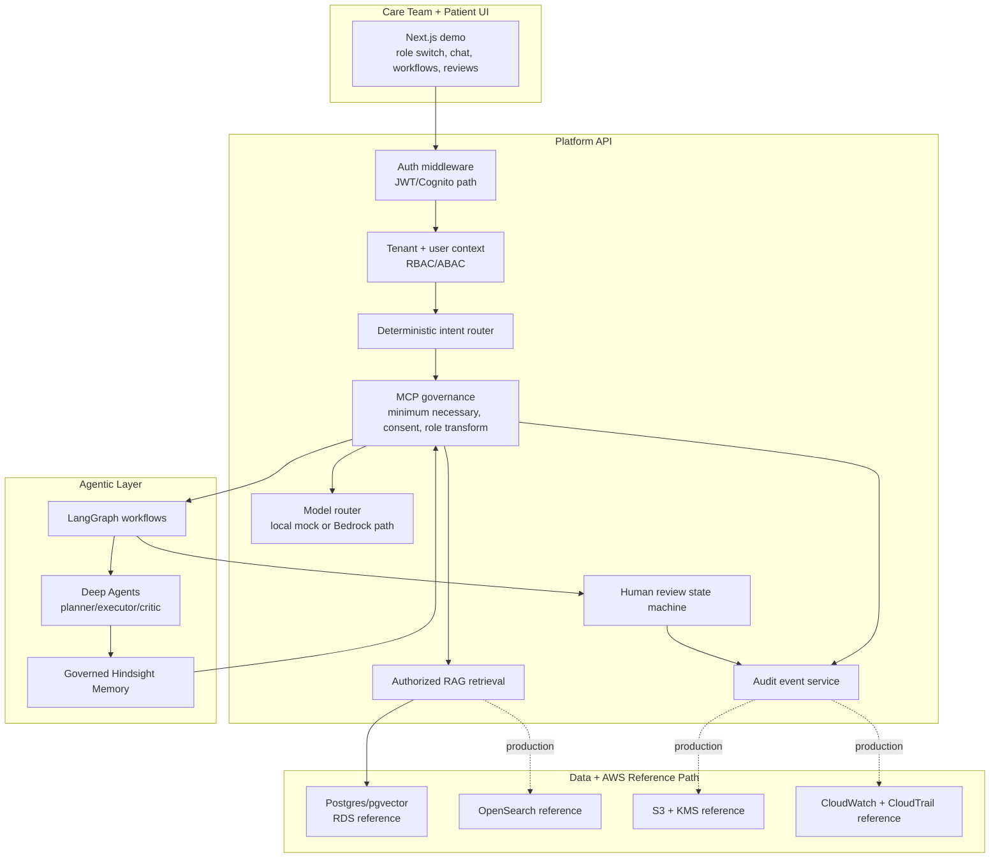

# careOS Flagship Case Study

## Executive Narrative

careOS demonstrates how a hospital AI platform can be designed around governance first. The product thesis is simple: clinical AI should not be a direct path from user prompt to model output. It should move through deterministic routing, tenant and patient authorization, minimum-necessary context selection, human review for high-risk outputs, and auditable operational controls.

The repository is intentionally framed as a **HIPAA-aware reference implementation**. It includes technical safeguards that map to HIPAA Privacy and Security Rule concerns, but it does not claim formal HIPAA compliance or audit certification.

## PM Problem Framing

| Product question | careOS answer |
| --- | --- |
| How do we keep patient data from reaching an LLM unnecessarily? | RAG retrieval is filtered by tenant, patient scope, consent, sensitivity, and role before MCP decides what reaches the model. |
| How do we avoid an agent making safety-critical routing decisions? | The router is deterministic-first and safety lexicon driven; agents are downstream executors, not primary routers. |
| How do we give clinicians useful AI without replacing judgment? | Chart summary, risk signal, and discharge outputs include disclaimers, citations, and human-review gates. |
| How do we support operations/compliance personas without blanket PHI exposure? | Admin and compliance roles receive de-identified operational excerpts by default and review metadata rather than unrestricted clinical text. |
| How do we make this demo credible to engineering leaders? | The repo includes tests, CI, Terraform reference modules, audit/event models, and explicit production gaps. |

## Implemented vs Planned Matrix

| Area | Implemented | Planned / still required |
| --- | --- | --- |
| Auth and identity | Demo JWT flow, Cognito JWKS validation path, NextAuth Cognito provider, role and tenant claims | Live Cognito pool, MFA policy validation, AWS token integration tests |
| Authorization | RBAC hierarchy, ABAC patient scope, tenant context, middleware checks, MCP double-checks | Production row-level security proof and break-glass operating procedure |
| Clinical AI routing | Deterministic intent router, safety overrides, route metadata, tests | Broader clinical taxonomy and clinician-approved routing thresholds |
| RAG governance | Tenant/patient/consent filters, MCP role transforms, prompt-injection blocking | Live OpenSearch relevance evaluation, retrieval poisoning red-team suite |
| Agent workflows | LangGraph chart summary, risk signal, discharge planning; Deep Agent registry for six complex routes | Full workflow persistence, reviewer assignment queues, live model evals |
| Human review | DB-backed review tasks with local fallback, role-filtered list and resolution, audit event creation | SLA queues, escalation policy, reviewer workload dashboards |
| Audit | Audit service, event list endpoints, route/review event examples | Immutable S3/WORM retention, SIEM export, alert rules, retention policy |
| Hindsight Memory | Governed non-authoritative memory candidates, memory audit minimization | Production memory lifecycle policy, user-visible controls, deletion workflows |
| Infrastructure | Modular Terraform for VPC, KMS, S3, RDS, Redis, OpenSearch, Cognito, ECS, WAF, CloudWatch, CloudTrail | Account-specific plan/apply evidence, remote state, Route 53, secrets rotation |
| UI | Single Next.js demo with role switching, chat, workflows, reviews, document upload | Full multi-page hospital application, accessibility QA, clinician UAT |
| Compliance | HIPAA-aware control mapping and clear non-production notice | Formal HIPAA risk analysis, BAAs, SOC 2/HITRUST roadmap execution |

## Architecture



## Role / RBAC Matrix

| Persona | Role key | Can access patient PHI? | Can run AI workflows? | Review authority | Notes |
| --- | --- | --- | --- | --- | --- |
| Patient | `patient` | Own patient record only | Patient-safe chat and general education | No | Patient-facing abnormal values trigger review. |
| Nurse | `nurse` | Assigned patients | Risk signal workflow | Assigned clinical tasks | Rate limit and ABAC are role-aware. |
| Clinician | `clinician` | Assigned or authorized tenant patients | Chart summary and safety triage | Clinical tasks | Human review remains a hard gate for safety-sensitive outputs. |
| Care coordinator | `care_coordinator` | Assigned or authorized tenant patients | Discharge planning | Care-coordination tasks | Discharge outputs are drafts, not final decisions. |
| Admin | `admin` | No blanket PHI access | De-identified operations | Admin/operations tasks | Operations view is intentionally de-identified. |
| Compliance officer | `compliance_officer` | Metadata and de-identified investigation path | Compliance review | Can view/resolve review metadata | Designed for audit investigation, not clinical care delivery. |
| Super admin | `super_admin` | Policy-dependent | Administrative workflows | Administrative tasks | Production scope should be narrowed by IAM and break-glass policy. |

## Synthetic PHI-Safe Demo Workflow

Demo patient IDs, names, notes, and documents are fictional. The demo should never use real patient data.

1. Start the stack with `docker compose up --build`.
2. Open `http://localhost:3000/?demo=true`.
3. Select `clinician@hospital-a.demo`; ask "Summarize the last 72 hours for pat_001 before rounds."
4. Select `care_coordinator@hospital-a.demo`; run "Deep Agent: Discharge Planning."
5. Open Review Queue; show the pending human review task and the context snapshot.
6. Select `patient@hospital-a.demo`; ask "Should I be worried about chest pain?"
7. Select `admin@hospital-a.demo`; ask for delayed discharge drivers and explain de-identification.
8. Select `compliance@hospital-a.demo`; show audit/review visibility boundaries.

## Audit Log Example

```json
{
  "id": "audit_demo_review_001",
  "tenant_id": "tenant_hospital_a",
  "user_id": "cc_001",
  "event_type": "human_review_task_created",
  "resource_type": "human_review_task",
  "resource_id": "rev_demo_001",
  "patient_id": "pat_001",
  "action": "create",
  "outcome": "success",
  "correlation_id": "demo-correlation-002",
  "details": {
    "task_type": "discharge_planning_review",
    "assigned_to_role": "clinician",
    "priority": "medium",
    "source": "langgraph_workflow",
    "mcp_policy": "minimum_necessary_context_only"
  }
}
```

## Threat Model Summary

| Threat | Impact | Implemented reference control | Evidence |
| --- | --- | --- | --- |
| Cross-tenant record access | PHI exposure and regulatory incident | Tenant context, ABAC patient checks, MCP tenant blocking | `core/context.py`, `core/middleware.py`, `services/mcp/service.py` |
| Agent bypasses governance | Unsafe or over-scoped model context | Router and MCP precede workflows; Deep Agent tools are scoped | `api/v1/chat.py`, `deep_agents/deep_agent_factory.py` |
| Prompt injection in retrieved notes | Model instruction hijacking | MCP blocks known injection markers in retrieved chunks | `tests/unit/test_mcp/test_mcp_governance.py` |
| Unsafe clinical advice to patient | Patient harm | Safety routing, disclaimers, review triggers, patient transforms | `services/intent_router`, `services/mcp/service.py` |
| Missing review accountability | No auditable clinician oversight | Review state machine and audit event creation | `api/v1/reviews.py`, `services/audit/service.py` |
| Admin overreach | Excessive privilege | Admins do not receive blanket clinical access by default | `core/security.py`, `tests/unit/test_reviews/test_review_authorization.py` |
| Logging PHI | Secondary disclosure | Structured redaction processor and minimized audit details | `core/logging.py`, `tests/unit/test_memory/test_memory_audit.py` |
| Supply chain vulnerabilities | Runtime compromise | CI includes lint, SAST, dependency audit, Trivy, Hadolint, secret scan | `.github/workflows/ci.yml` |

## Screenshots

The portfolio-safe screenshots live in [docs/screenshots](screenshots/):

- [Governed chat and citations](screenshots/careos-chat-governance.svg)
- [Workflow and review queue](screenshots/careos-workflow-review.svg)

## 5-Minute Demo Talk Track

Use [DEMO_SCRIPT_5_MIN.md](DEMO_SCRIPT_5_MIN.md) as the exact timed script. The core storyline:

1. Start with the safety thesis: governance before generation.
2. Show role-aware access and no blanket admin PHI.
3. Run governed RAG and point to route, confidence, citations, and disclaimers.
4. Run discharge planning and show human review as a workflow gate.
5. Close with the implemented-vs-planned matrix to demonstrate senior judgment.

## Gap-Closure Checklist

See [GAP_CLOSURE_CHECKLIST.md](GAP_CLOSURE_CHECKLIST.md) for the current recruiter-facing closure list. The key message: the repo now presents both the strongest implemented evidence and the remaining production work without claiming audit evidence that does not exist.
